# 餐饮多门店系统

面向连锁餐饮的经营管理后端 + 内部人员网页端。跑通的业务闭环是：

```
老板配菜单 → 各店定自己的价 → 下单 → 门店接单 → 收款 → 完成
```

一套 Flask 后端 + 三个客户端（内部人员网页端 Vue3、内部人员小程序端 uni-app、顾客小程序端 uni-app），
三端共用同一套业务逻辑和权限体系——**三个客户端现在都有了**。
一期（核心交易闭环）和二期（会员资产 + 老系统共存）**都已收尾**，
三期（多角色管理与经营分析）在做，见下面「已经能跑通的」。

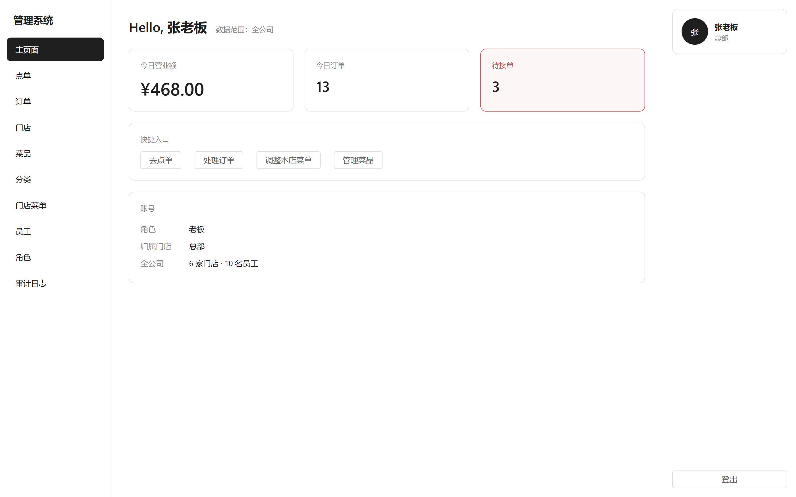

## 快速开始

需要 MySQL 8 和 Node 20+。四条命令：

```bash
# 1. 后端依赖
python -m venv .venv
source .venv/Scripts/activate          # Windows（Linux/macOS 用 .venv/bin/activate）
pip install -r backend/requirements.txt

# 2. 配置数据库并建库
cp backend/.env.example backend/.env   # 改里面的 DATABASE_URL 为你的 MySQL 账号密码
python create_db.py                    # 自动创建 .env 里指定的库

# 3. 建表 → 灌权限 → 灌演示数据
cd backend
flask db upgrade
python manage.py seed-rbac             # 38 个权限码 + 8 个预置角色
python manage.py seed-demo             # 6 家门店、15 道菜、9 个账号、12 笔订单、券和会员
python manage.py import-legacy         # 从（模拟的）老系统迁会员和储值，顺便记下 ID 映射和同步记录
python manage.py reconcile             # 跑一次日结对账——「一分不差」是这一条命令说出来的

# 4. 起服务
flask run --debug                      # 后端 :5000
cd ../web-staff && npm install && npm run dev   # 内部人员网页端 :5173
cd ../mp-staff && npm install && npm run dev:h5      # 员工小程序（H5 版）:5175
cd ../mp-customer && npm install && npm run dev:h5   # 顾客小程序（H5 版）:5174
```

> 顾客小程序端的详细说明（怎么用微信开发者工具打开、真机预览要改什么）
> 见 [mp-customer/README.md](mp-customer/README.md)。

浏览器打开 http://localhost:5173，用下面的账号登录。接口文档在 http://localhost:5000/apidocs/。

> **`flask` 命令必须在 `backend/` 目录下运行。** Flask 靠当前目录里的 `wsgi.py` 找应用，
> 在项目根目录跑会报 `Error: Could not locate a Flask application`。
> 不想切目录的话，用 `flask --app backend.wsgi run --debug`。
> （`python manage.py ...` 没有这个限制，它自己会把项目根加进 `sys.path`。）

> **`seed-rbac` 和 `seed-demo` 只能用 `python manage.py` 跑，不能用 `flask`。**
> 它们定义在 `manage.py` 的 `FlaskGroup` 里，而 `flask` 命令从 `wsgi.py` 找应用——
> 那个应用上只有 `db` 这类内置命令，`flask seed-rbac` 会报 `No such command`。

> 第 3 步的 `flask db upgrade` 只是建表；**没有 `seed-rbac` 的话所有角色都没有权限**，
> 除了超级管理员谁都干不了活。

## 演示账号

密码统一是 `Demo123!`。**换个账号登录，看到的菜单和按钮都不一样**——这是权限体系最直观的演示：

| 账号 | 角色 | 登录后能看到 |
| --- | --- | --- |
| `laoban` | 老板 | 全部菜单，含门店管理、员工管理、审计日志 |
| `yunying` | 运营主管 | 菜单管理（菜品/分类/门店菜单）、门店查看；**看不到**员工、订单和审计 |
| `caiwu` | 财务 | 订单、门店；**碰不了菜单**，也没有点单入口 |
| `dianzhang` | 店长 | 点单、本店订单、本店菜单定价、本店员工、角色矩阵；**看不到别家店**，也进不了公司级的菜品/分类页 |
| `zhiban` | 值班经理 | 点单、订单（含取消）；**批不了大额退款** |
| `shouyin` | 收银员 | 点单、订单（接单/收款）；**没有取消订单的权限** |
| `fuwuyuan` | 服务员 | 点单、订单；只能代客点单，不能收款 |
| `gongyong` | 服务员（公用账号） | 同上——注意演示数据里它的订单记的是「实际操作人」而不是账号本身 |
| `houcu` | 后厨 | 只有订单，用来看单出餐（**没有点单**——后厨不点菜） |

用 `shouyin` 和 `dianzhang` 对照着登一遍，权限和数据范围的区别一眼就能看出来。

**员工小程序上这个差别更直观**：同一个账号登进去，看到的入口和按钮都不一样——
收银员三样都有，服务员只有「代客点单」，后厨只有「看单」。

**顾客端不用这些账号**——随便填一个 11 位手机号就行（第一次登录自动建档）。
演示时想直接看到储值/积分/券，用 `13800138001`（陈小姐）之类的号登，
和后端演示会员对得上；想演示「新用户」就随便编一个号。

## 已经能跑通的

- **门店管理** —— 6 家店的档案、营业状态、灰度切换模式（老系统/新系统）；删除有引用保护
- **员工账号** —— 角色分配、门店归属、全职/兼职、公用账号
- **权限体系** —— 38 个权限码 × 8 个预置角色 × 数据范围（本店/全部），后端强制、前端按权限渲染
- **菜单管理** —— 菜品分类（含适用门店）、菜品、规格组/选项（份量/辣度/加料，单选多选必选）
- **多店定价** —— 同一道菜各店不同价、各店独立上下架、每日限量
- **点单收银** —— 点单界面（分类浏览、规格选择、购物车）、接单、完成、取消、收款（支持组合支付）

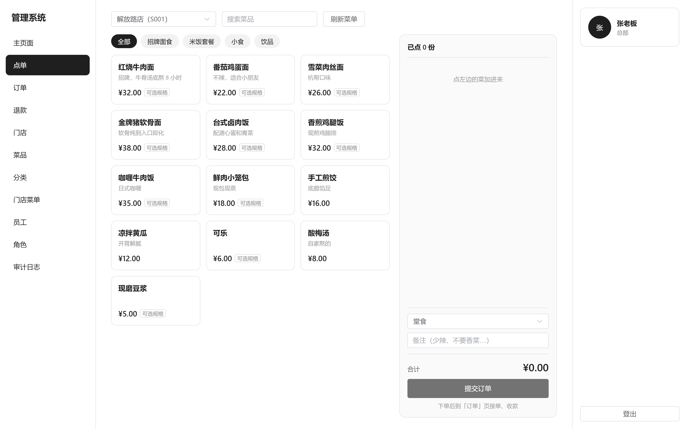

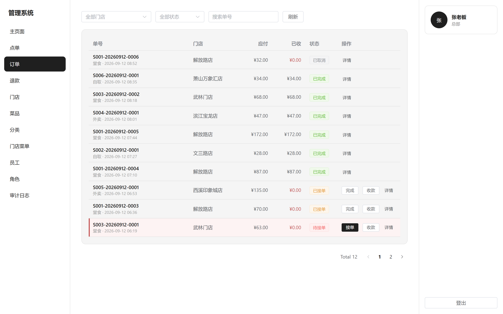

- **退款审批流** —— 申请 → 审批 → 确认打款三步走，**审批通过不等于钱退了**；
  线下退款也要补录留痕；超过限额的退款要更高权限

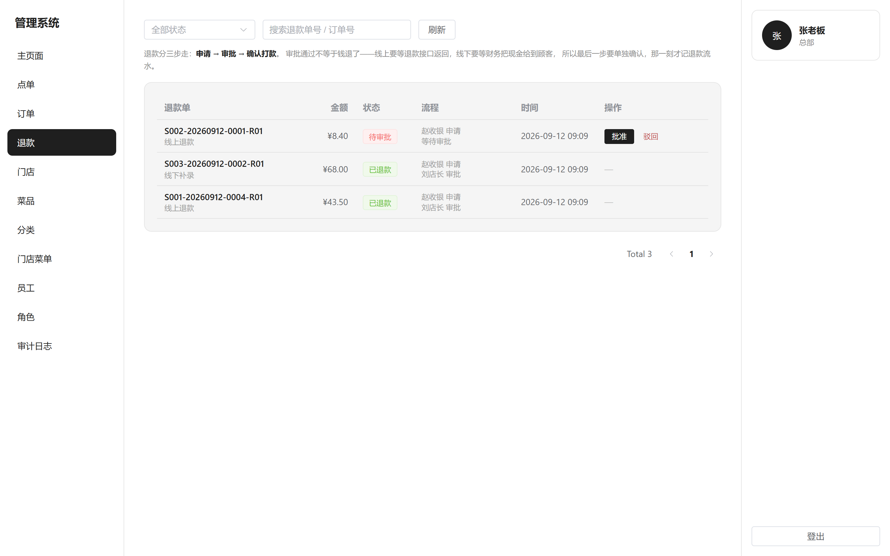

- **团购券核销** —— 扫码核销美团/抖音团购券，券码**全局唯一**（同一张券核销第二次会被拒）；
  核销记录按平台留着，月底拿去对账
- **打小票** —— 80mm 热敏纸版式的预结单/小票，可直接调起浏览器打印

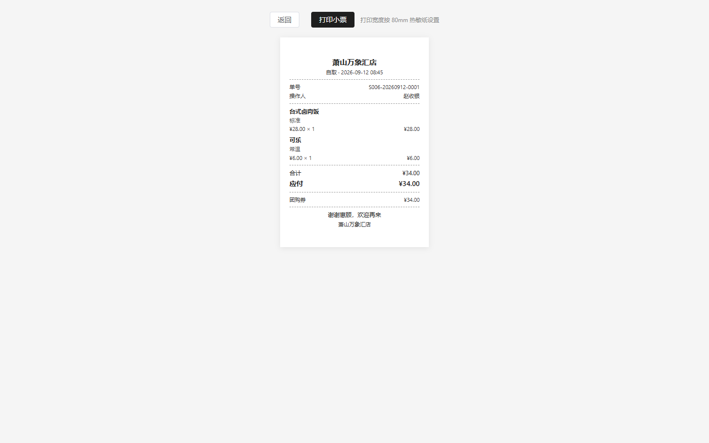

- **顾客小程序** —— 底部四个 tab：**首页（门店介绍 + 近期活动）/ 点餐 / 订单 / 我的**。
  uni-app 一套代码编译到微信小程序 + H5。
  查订单要「单号 + 随机令牌」——单号是可读可猜的，光凭单号能查到别人的订单

  **门店存在本地**：改成了常驻 tab 之后，点餐页得知道自己点的是哪家店，
  首页那张卡片负责显示和切换（换店会清空购物车——A 店点的菜到了 B 店可能没有）

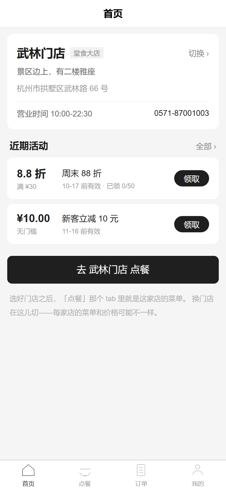
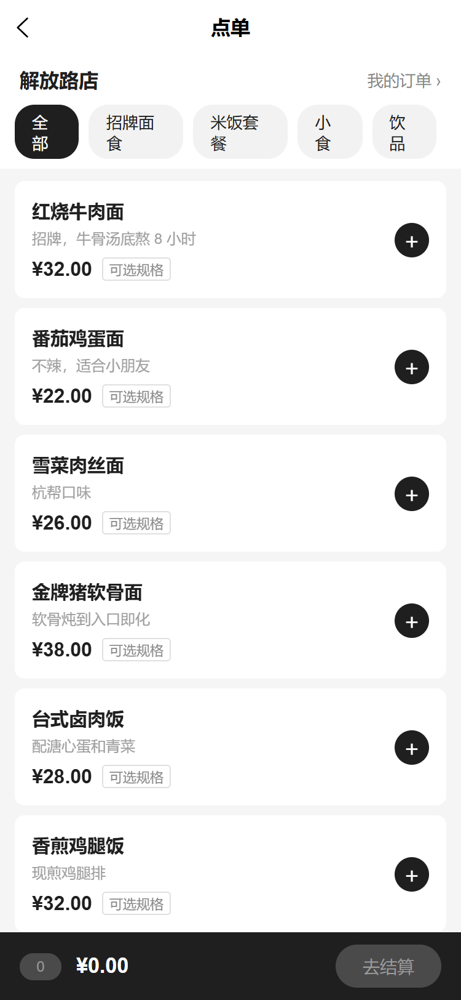
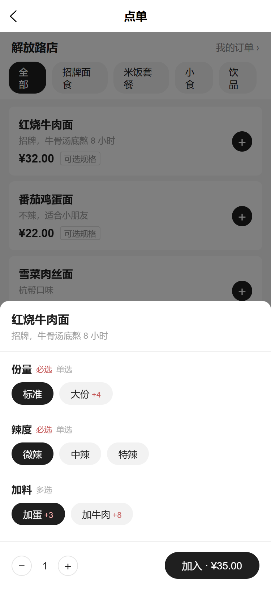

- **顾客端会员**（二期）—— 手机号 + 验证码，**登录即注册**（第一次登录自动建档，
  不单独做注册页）。登录后能看到储值余额、积分和券包

  **这一端不强制登录**：菜单、下单、查订单都不需要，顾客扫了码就能点；
  注册是「想攒积分、有券要花」时才做的事

  认证走的是**员工那条 token 通道的姊妹版**：同一套签名，
  但载荷里带 `typ` 区分——员工的 token 拿去调顾客接口会被拒，反之亦然
  （两张表的 id 都是自增的，不判类型会认错人）

  **首页的「近期活动」不需要登录**（后端那个接口是 `member_optional`）：
  「这家店有什么活动」本来就是公开信息，一进首页就是登录墙太难看。
  点「领取」的时候才要求登录——券得挂在人头上

- **券中心**（二期）—— 顾客自己领券，模板上带「可领取」和「每人限领 N 张」。
  **领不到的券也列出来并写明原因**（「每人限领 2 张」「已经被领完了」）——
  一张券摆在眼前却说不清为什么领不了，比它干脆不出现更让人恼火


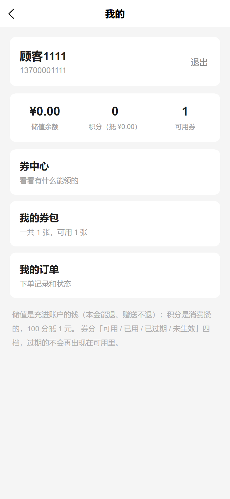
- **会员 + 储值**（二期）—— 会员全公司通用；储值**本金和赠送分开记**，
  余额支付接进了收款流程（一单最多扣一笔），退款能按原消费的比例退回储值

  三条规则值得单独说：
  **① 余额必须有流水账**，不能只存一个数字——那 80 万要一分不差，全靠流水对得上
  **② 充 100 送 20 要记两条流水**：本金是收入、赠送是营销成本，报表上是两回事
  **③ 扣款先扣赠送再扣本金**：先花掉不能退的那部分，本金留着随时能退

- **积分**（二期）—— 消费 1 元返 1 分、100 分抵 1 元，**两个方向汇率不同**；
  退款时按退款金额把当初返的扣回来
- **优惠券**（二期）—— 券模板（规则）和用户持券（实例）**拆两张表**；
  建券、发券、券包、下单用券全通了，券和积分可以叠加

  一个值得说的决定：**过期不写库**。库里只有「未使用 / 已使用」两种状态，
  过期和「还没到生效时间」都是每次现算的。要是写库就得靠定时任务去扫，
  任务挂了就烂在那儿，而且谁也说不清一条记录是什么时候变脏的。
  代价是查「可用券」时每条都得带时间判断——这个代价更便宜。

  `seed-demo` 里专门留了两张券演示这件事：一张已经过期、一张还没到生效时间。
  它们在数据库里的 `status` **都还是 `unused`**，界面上却分别显示「已过期」和「未生效」

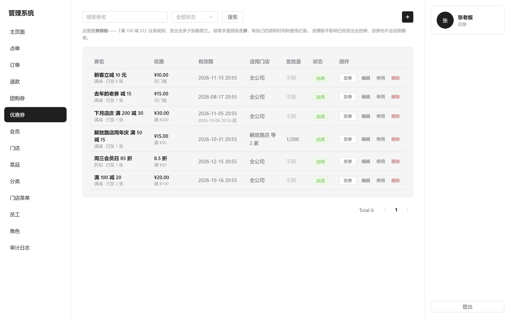

- **老系统共存**（二期）—— 灰度切换期间新老系统并行跑，靠三件套让两边对得上：

    老系统的号 → 新系统的谁    `python manage.py import-legacy` 一条条记，之后能倒查
    推过去了没有               成功也记，不然「今天到底推没推」说不清
    账对不对得上               `python manage.py reconcile`，日结那个定时任务本身

  **对账对的是「自己跟自己」**：储值是「账户余额 vs 流水累加」，订单是
  「订单实收 vs 支付流水」。设计文档说储值那 80 万要一分不差——第一步就是先证明
  新系统自己记的账和流水是自洽的，账都自己跟自己对不起，跟别人比更没有意义。
  （拿老系统的日报来比是另一半，**没有外部数据源就没做**，见下面「哪些是模拟的」。）

  一个容易漏的点：**「对不对得上」不能只看差异金额**。一个会员多 100、
  一个会员少 100，合计正好抵消、差值是 0，但这两处都是错的。
  所以记录里单有一个 `mismatch_count`，状态由它决定。

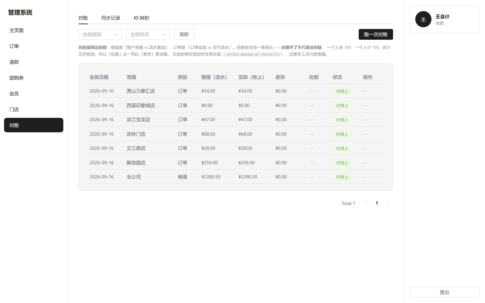

- **员工小程序**（二期）—— 代客点单、接单出单、团购券核销。只放门店一线用得上的
  三件事，**菜单/员工/报表那些不在这儿**（手机屏幕塞不下，硬塞只会让每件事都变难用）

  **走的是另一条认证通道**：token，不是 session cookie。后端只多了一个
  `/api/auth/token` 和一个 `request_loader`，`current_user`、权限判断、数据范围、
  审计日志一行都不用改——这就是「两条通道共用同一套 service 层」的落地方式。

  用不同账号登进去界面不一样（权限体系最直观的演示）：收银员三样都有、
  服务员只有代客点单、**后厨只有看单**——他没有 `order:receive`，
  订单页显示成「只读」，见 `mp-staff/README.md` 里那节说明

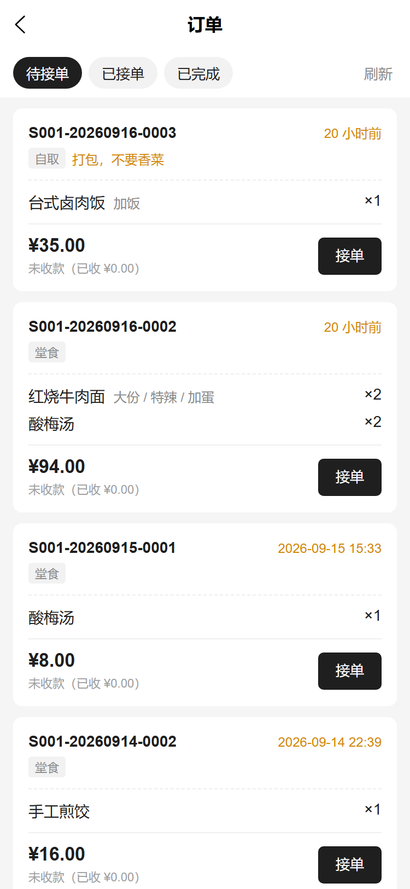

- **经营报表**（三期）—— **一个接口两个角色**：店长看本店、老板看全公司，
  差别只在数据范围（`report:store` / `report:all` 是「能不能看报表」，
  `accessible_store_ids` 才是「能看哪几家」）

    营业额 / 单量 / 客单价 / 退款取消 · 营业额趋势 · 支付方式构成
    热销菜品（按份数）· 时段分布（给排班用）· 门店对比

  **口径写在页面上**：营业额 = 已收 − 已退、排除取消的单；营业日按**下单时间**
  算（和订单号里的日期、日结对账同一个口径）；时段按本地时间分——
  库里存 UTC，直接按 UTC 分组的话，中午那波单会被算成早上 4 点

  柱子和横条都是 CSS 画的，**没引图表库**：这个项目的视觉是极简黑白，
  图表库的默认配色反而突兀，而且「7 天趋势」用柱子表达完全够

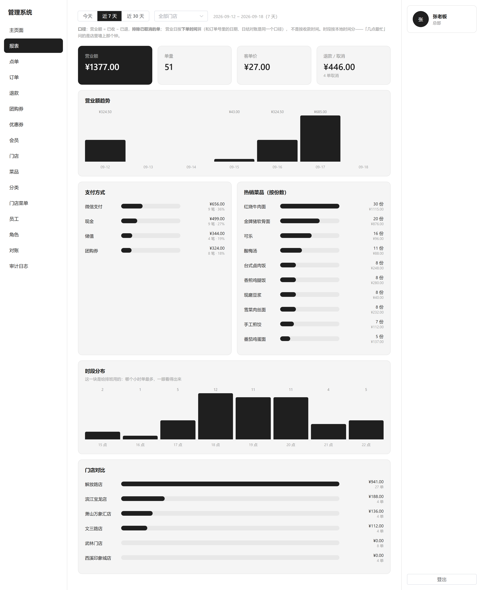

- **审计日志** —— 改价、上下架、发券、开停账号等关键动作自动留痕，含变更前后值
- **角色权限矩阵** —— 8 个角色 × 38 个权限码的全貌，一眼看出谁能在哪些门店做什么

## 几个设计上的取舍

这部分是这个项目里最值得看的东西——每个决定都有具体的理由，不是随手写的。
完整版（17 条）在 **[docs/设计决策.md](docs/设计决策.md)**，下面挑四条讲。

### 一、权限分两层：能不能干 vs 能碰哪些数据

餐饮门店最容易踩的坑，是以为「能不能干」和「能碰哪些数据」是一回事。

比如 `dish:price:edit`（改价）这个权限，**店长和运营主管都有**。区别不在能不能改，
而在**能改哪些**：店长只能改自己那家店的价，运营主管能改全公司的。

所以权限模型是两层的：

| 层 | 挂在哪 | 管什么 |
| --- | --- | --- |
| 权限码 | 角色 | 能不能干这件事（`store:view` / `order:refund`） |
| 数据范围 | 角色 | 能碰哪些数据（`store` 本店 / `all` 全部） |

**数据范围必须挂在角色上，不能挂在权限码上**——一旦把范围写进权限码，就得为每个
角色各造一套权限码（`dish:price:edit:store`、`dish:price:edit:all`……），组合爆炸。

权限码目录（`backend/app/rbac.py`）是**代码而不是数据库里的数据**，`python manage.py seed-rbac`
幂等同步。这样「谁把收银员的核销权限去掉了」能查 git blame，改乱了也能一键还原。

全貌长这样（8 个角色 × 38 个权限码，数据范围单独一行）：

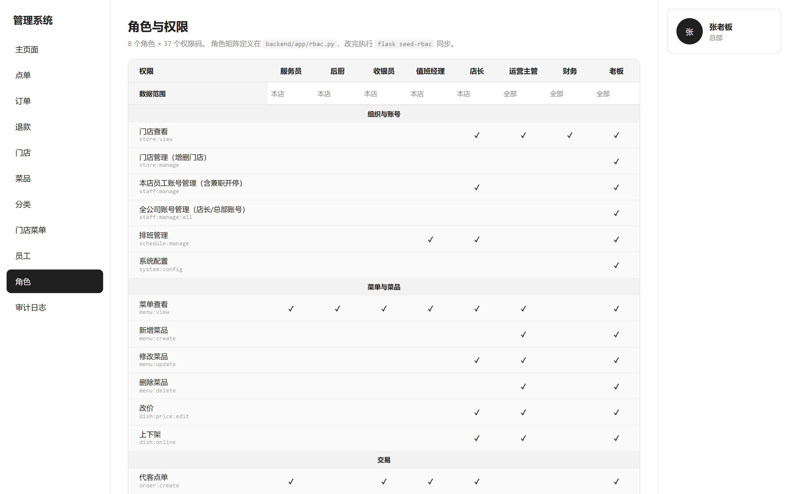

角色与权限之间用的是纯关联表（`db.Table` 而非建模成类）：关联本身没有额外属性，
而**复合主键能在数据库层挡住重复关联**——同一个员工同一个角色物理上不可能出现两条。

### 二、多店定价：菜品和门店解耦

设计里最容易做错的一件事，是在菜品表上放一个 `price` 字段然后到处覆盖。

这里的做法是拆成两层：

```
dish（菜品基础）        名称、图片、描述、分类、基础价   ← 全公司一套
  └── store_dish        覆盖价格、是否上架、每日限量      ← 每家店一行
```

**关键约定：没有行 = 用默认值。** 不是每家店每道菜都有一行，而是「这家店对这道菜
做了特殊设置」才有一行；没有行就是基础价、可售、不限量。

不这么做的话：6 家店 × 50 道菜 = 300 行，运营每加一道菜要手动上架 6 次。

代价是「查某道菜在某店的价格」要合并两层，所以有 `effective_price` 和 `_merge()`
把这件事收在一处，调用方不用自己判断 `price` 是不是 `None`。

界面长这样——西溪印象城店把红烧牛肉面调到 ¥35（基础价 ¥32 划掉）、限量 30 份，
其他店不受影响：

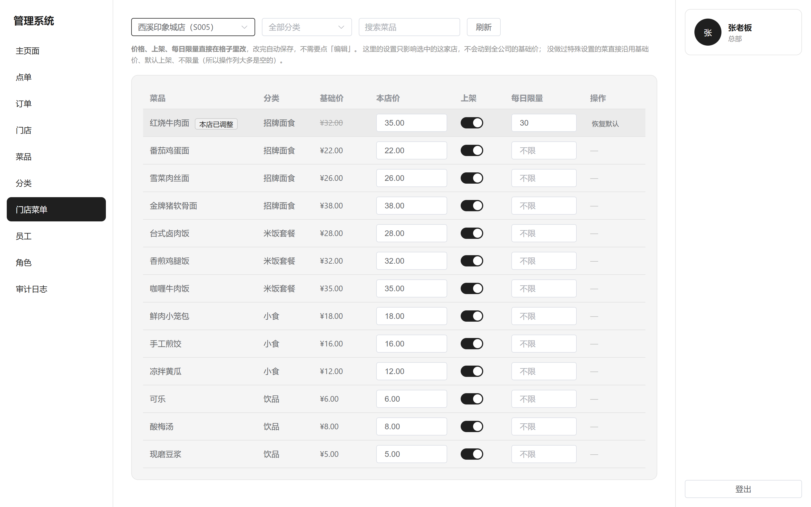

### 三、订单：快照和引用，两个都要

订单明细里的菜名和单价，**必须存快照**——运营明天把「牛肉面」改名成「红烧牛肉面」、
涨价到 ¥40，历史订单要还原成下单当时的样子，否则月底对账时「这单到底卖了多少钱」说不清。

但只存文本快照又不行：设计里要求「统计加蛋卖了多少份」「控加牛肉的库存」，
纯文本做不到。所以明细里**同时**保留 `dish_id` 和 `dish_option_id` 的引用。

**快照负责还原，引用负责统计。**

同理，支付没有做成订单上的一个「已支付」布尔字段，而是单开一张 `payment` 表：

- 一个订单可能有**多笔支付**：组合支付（储值付一部分 + 现金付一部分）、先定金后尾款
- 支付有**资金属性**：第三方流水号、支付时间——**财务对账全靠它**

以及一条业务规则：**已收款的订单不能直接取消**。钱得先退回去，退款走独立的审批单。
否则就会出现「订单取消了但钱还在我们账上」。

### 四、删除保护：扫外键，而不是手写清单

每个实体删除前都要检查「还有没有别的东西在引用我」。手写「要检查哪些表」的清单迟早会漏，
所以反过来扫 SQLAlchemy metadata 里所有指向目标主键的外键——新表只要建了外键就自动覆盖。

其中 **`ondelete='CASCADE'` 的外键会被跳过**：CASCADE 表示「从属/关联」
（规格选项属于菜品、角色绑定属于员工），父记录删了子记录跟着走，不算阻塞；
只有 RESTRICT / SET NULL 才是真正的「外部还在引用」。

这里有个细节：`ondelete` 这个参数**本身就已经表达了「从属还是引用」**，
所以检查逻辑不需要再手工维护一份「哪些表算从属」的名单——直接读它。建模时的意图，
被复用成了运行时的判断依据。

## 技术栈

**后端** Flask 3 · SQLAlchemy · Flask-Migrate(Alembic) · Flask-Login · Flask-WTF(CSRF) ·
Marshmallow / flask-smorest（schema 即接口文档）· MySQL

**前端** Vue 3 + TypeScript · Vite · Vue Router · Pinia · Element Plus · Axios

## 项目结构

```
restaurant-system/
├── backend/
│   ├── app/
│   │   ├── models/        # 数据模型（BaseModel 带公共时间戳）
│   │   ├── schemas/       # Marshmallow 校验（同时生成 OpenAPI 文档）
│   │   ├── services/      # 业务逻辑 + 数据范围 + 审计
│   │   ├── api/           # 蓝图路由
│   │   ├── rbac.py        # 权限码目录 + 预置角色（权限体系的唯一事实来源）
│   │   ├── demo.py        # 演示数据定义
│   │   ├── legacy_import.py  # 老系统迁移（模拟的导出数据 + 迁移逻辑）
│   │   └── utils/         # 统一响应、权限装饰器、外键引用检查
│   ├── migrations/        # Alembic 迁移
│   └── tests/             # pytest（300 个）
├── web-staff/             # 内部人员网页端（Vue3）
│   └── src/
│       ├── api/           # axios 封装 + 按领域拆分的接口模块
│       ├── views/         # 页面
│       ├── components/    # 表单弹窗、详情弹窗
│       ├── stores/auth.ts # 登录态 + 权限
│       └── constants/     # 枚举选项（与后端模型常量一一对应）
├── mp-staff/              # 员工小程序端（uni-app，代客点单/出单/核销，token 认证）
│   └── src/
│       ├── api/           # uni.request 封装（带 Bearer token）+ 接口模块
│       ├── pages/         # 登录 / 首页 / 点单 / 订单 / 核销
│       └── stores/        # 登录态（token + 权限）、购物车
├── mp-customer/           # 顾客小程序端（uni-app，编译到微信小程序 + H5）
│   └── src/
│       ├── api/           # uni.request 封装 + 顾客端接口
│       ├── pages/         # 选门店 / 点单 / 我的订单 / 订单详情
│       ├── stores/        # 购物车、本地订单记录（没用 Pinia，模块级 reactive 够）
├── docs/                  # 需求与设计文档
└── docker-compose.yml     # MySQL + Redis + 应用一键起
```

## 哪些是模拟的

做一个真实系统时会卡在别人手里的部分，这里**明确标出来**，而不是假装做完了：

| 能力 | 现状 |
| --- | --- |
| **微信支付** | 未对接。目前收款只是「记账」（记下方式、金额、第三方流水号），签名、回调验签、退款调用都还没写 |
| **团购券核销** | 券码是收银员手工输入的、平台手选的，**没有真的调美团/抖音的核销接口**。真对接时要加一步「调平台接口验证券码有效性」，面额也不该由人工填 |
| **优惠券的发放** | 券能用、能发、能核账了，但**顾客自己领券**还没做——现在只能员工在后台发。平台买的券（美团/抖音）自动进券包也没做，那条要等顾客端登录打通 |
| **微信登录** | 会员表留了 `openid` / `unionid`，但没有真 AppID 接不了。顾客端登录改走**手机号 + 验证码** |
| **发短信** | 验证码是真生成、真校验（5 分钟过期、用一次作废、错 5 次作废、60 秒才能重发），**只有「发送」这一步是假的**——真发短信要网关，现在写日志 + 演示环境回显。和微信支付一个路子：协议层是真的，外部依赖标成模拟 |
| **退款的「打款」这一步** | 流程走通了（申请→审批→确认打款→记流水），但确认打款目前只是记账，没有真的调微信退款接口 |
| **ERP 对接** | 没做。ERP 和门店系统之间推订单、拉库存那套接口不存在可对接的实物 |
| **跟老系统对账的那一半** | 「我们记的数 vs 老系统报的数」**做不了**——需要老系统导出的日报，没有那个数据源，硬做就是编。做的是「自己跟自己」的那一半（账户余额 vs 流水累加），README 上面写了理由 |
| **老系统迁移** | 迁的是**一份模拟的导出数据**（`app/legacy_import.py` 里那个常量，真做时换成读 CSV）。迁移逻辑、ID 映射、同步记录、对账都是真的 |
| **顾客小程序的支付** | 「立即支付」只是把「钱付了」记下来，流水号带 `MOCK` 前缀。**协议层已经写好并测过**（签名/验签/AES 解密 + 自建模拟网关），差的是接到业务流程里和一个真商户号 |
| **员工小程序的微信登录** | 小程序本身做好了（账号密码登录 + token），但走的是员工账号，**没有微信一键登录**——那同样要真 AppID |

## 开发

```bash
# 后端（在 backend/ 目录下）
cd backend
flask run --debug                      # 开发服务器 :5000
flask db upgrade                       # 应用迁移
python manage.py seed-rbac             # 同步权限码与角色（改了 rbac.py 之后跑）
python manage.py seed-demo             # 灌演示数据（--reset 清空重建）
python manage.py import-legacy         # 从老系统迁会员和储值（模拟数据，幂等）
python manage.py reconcile             # 日结对账（定时任务就是这条命令）
python manage.py create-admin          # 创建超级管理员
pytest                                 # 全部测试
pytest --cov=app tests/                # 带覆盖率
ruff check . --fix                     # 代码规范

# 前端（在 web-staff/ 目录下）
cd web-staff
npm run dev                            # 开发服务器 :5173，代理到 5000
npm run typecheck                      # vue-tsc 类型检查
npm run lint                           # ESLint
npm run test                           # vitest 单元测试
npm run build                          # 生产构建
```

**新模块的固定流程**（以「加一个库存管理」为例）：

1. `models/xxx.py` → `schemas/xxx_schema.py` → `services/xxx_service.py` → `api/xxx.py`
2. 在 `app/__init__.py` 的 `register_blueprints` 里注册
3. `flask db migrate -m "xxx"` 生成迁移

   ⚠️ **给已有数据的表加 `nullable=False` 的列，生成的迁移会跑失败**（Alembic 不知道
   老行该填什么）。要手工补一个 `server_default`，填完老数据再撤掉：

   ```python
   batch_op.add_column(sa.Column('points_used', sa.Integer(), nullable=False,
                                 server_default='0'))
   batch_op.alter_column('points_used', server_default=None)   # 别留隐式默认
   ```

   这个坑已经踩过四次（`staff.employment_type`、`order.refunded_amount`、
   `order.query_token`、`order.points_used`），**不是偶发**——新表不受影响，
   给老表加必填列必然会遇到。

   ⚠️ 另外两条，踩过就知道疼：

   - **外键要显式起名**：`sa.ForeignKeyConstraint(..., name='fk_<表>_<列>')`。
     交给 MySQL 起名会得到 `order_ibfk_3` 这种带序号的，换个环境序号一变，
     `drop_constraint` 就找不到它了（见 `52bd067fde97`）
   - **自动生成的 `downgrade()` 有可能是坏的**：它会先 `drop_index` 再 `drop_table`，
     但外键用着的那条索引 MySQL 不让单独删（errno 1553）。表都要删了，
     索引跟着走就行——把那几行 `drop_index` 删掉，留 `op.drop_table(...)`。
     **生成完迁移顺手 `flask db downgrade` 再 `upgrade` 一遍**，十秒钟的事
4. 权限：在 `app/rbac.py` 的 `PERMISSIONS` 登记权限码 → 决定哪些角色拥有 → `python manage.py seed-rbac`
   （**改了 rbac.py 一定得跑这一步**：新码不落库的话，前端 `hasPermission` 就是 false，
   按钮不显示——不报错，只是"点不到"，很难往这上面想）
5. 接口挂 `@permission_required('xxx:yyy')`；**能碰哪些数据**另算，由 service 层按 `current_user.accessible_store_ids()` 过滤
6. 前端：`api/xxx.ts` → `views/XxxView.vue` → router 加子路由（`meta: { permissions: [...] }`）+ Sidebar 的 `ALL_MENUS` 加一项

## 关于这个项目

一个练习作品，用来把「多门店餐饮系统」这套业务从头到尾做一遍。
需求文档和设计决策都放在 `docs/` 下。
